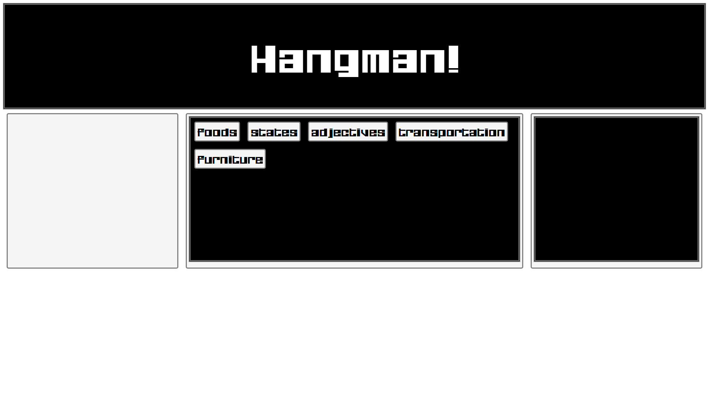

* **MSSE 600 - Assignment Submission Document**

* **Name: Chad Conway**

* **Date: 10 / 17 / 2017**

* **I. Assignment Name: Hangman**

II. Learning Objectives: (here is an example)
=============================================

-   Draw gallows and stick person on canvas when player makes a wrong guess

-   Display an alphabet with events to remove characters that have been selected

-   Use an external script page to hold 5 categories of words with 10 words in
    each

-   Player clicks on alphabetical characters in an attempt to guess the current
    word

-   Player may select from five categories of words

>   III. **Abstract** –

-   Game screen consists of a "flex" design. Design includes:

    -   A title "header"

    -   3 "flex-items" positioned horizontally and will resize depending on
        screen resolution and size:

        -   The gallows canvas on the left.

        -   The "wordBlock" in the center displays first game categories, then
            the current word to be guessed

        -   An "alphabetBlock" furthest right which contains all letters of the
            alphabet initially. As the user clicks a selection, the letter is
            removed and either the letters are revealed in the current word. or
            another portion of the gallows is drawn with animation.

    -   Game consists of animation elements:

        -   Gallows-each section is drawn with animation.

        -   If the player loses, the stick figure in the gallows swings back and
            forth.

    -   Modals are used to indicate a win or loss. Closing the modal resets the
        game.

-   Game build is modular. Consisting of:

    -   Javascript files:

        -   **gameBoard.js:**

            -   *setup()* – Onload clears canvas and word blocks. Calls
                getCategory() for initial selection.

            -   *drawAlphabet()* – Fills the "alphabetBlock" flex item with the
                characters of the alphabet.

            -   *drawWord()* – Draws the current word to solve. Grayed boxes
                show spaces, and each new word, if multiple words, begins on a
                new line.

        -   **controller.js:**

            -   *getCategory()* – Reads **words.js** and displays the categories
                of words.

            -   *getWord() –* Selects random word from selected category.

            -   *letterChoic() –* Takes user selected character from
                alphabetBlock. Checks to see if the current word contains a
                match, if so reveals it. If not, calls *drawHangman().*

            -   *showWord()* – If player loses, reveals the unsolved characters
                of the current word.

        -   **animation.js:**

            -   *drawHangman() –* Draw next section of gallows or stick player.

            -   *endAnimation() –* If player loses, swings the stick player from
                the gallows.

**IV. Statement of Originality**
--------------------------------

>   This game is the original work of myself, programmatically and design-wise.
>   The coneptual framework for Hangman is the property of the whoever so holds
>   the current copyright, if any.

**V. Screen-shot of design document or application (also include a figure title and note for** 
-----------------------------------------------------------------------------------------------

*Screenshot 1 – Index.html*

*Screenshot 2 – gameboard.js*

*Screenshot 3 – words.js*

*Screenshot 4 – style.css*

*Screenshot 5 – controller.js function getCategory()*

*Screenshot 6 – controller.js function getWord()*

*Screenshot 7 – controller.js function letterChoice()*

>   *Screenshot 8 – controller.js function showWord() & showModal()*

*Screenshot 9 – animation.js function drawHangman()*

>   C:\\Users\\chadc_000\\AppData\\Local\\Microsoft\\Windows\\INetCache\\Content.Word\\Screenshot
>   (194).png

>   *Screenshot 10 – animation.js function endAnimation()*

*Screenshot 11 – Gameplay – Opening Screen*

>   C:\\Users\\chadc_000\\AppData\\Local\\Microsoft\\Windows\\INetCache\\Content.Word\\Screenshot
>   (196).png

*Screenshot 12 – Gameplay – After category selection*

>   C:\\Users\\chadc_000\\AppData\\Local\\Microsoft\\Windows\\INetCache\\Content.Word\\Screenshot
>   (197).png

>   *Screenshot 13 – Gameplay during word guessing*

>   C:\\Users\\chadc_000\\AppData\\Local\\Microsoft\\Windows\\INetCache\\Content.Word\\Screenshot
>   (198).png

>   *Screenshot 14 – Gameplay winning modal*

>   C:\\Users\\chadc_000\\AppData\\Local\\Microsoft\\Windows\\INetCache\\Content.Word\\Screenshot
>   (199).png

>   *Screenshot 15 – Gameplay first gallows animation*

>   C:\\Users\\chadc_000\\AppData\\Local\\Microsoft\\Windows\\INetCache\\Content.Word\\Screenshot
>   (200).png

>   *Screenshot 16 – Gameplay allows drawn, ready for stick figure*

>   C:\\Users\\chadc_000\\AppData\\Local\\Microsoft\\Windows\\INetCache\\Content.Word\\Screenshot
>   (201).png

>   *Screenshot 17 – Gameplay player lost, word revealed, gallows begins
>   swinging*

>   C:\\Users\\chadc_000\\AppData\\Local\\Microsoft\\Windows\\INetCache\\Content.Word\\Screenshot
>   (203).png

>   *Screenshot 18 – Gameplay player lost, modal revealed after delay*
